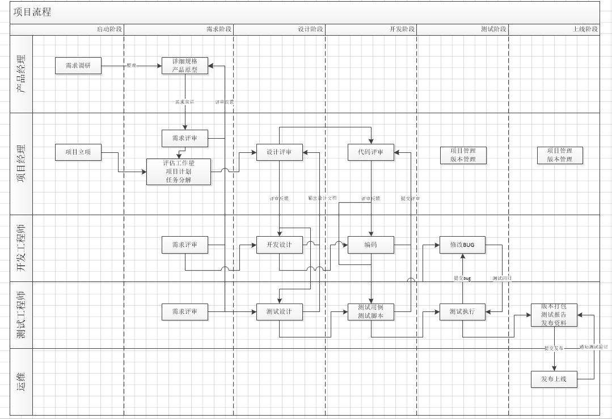
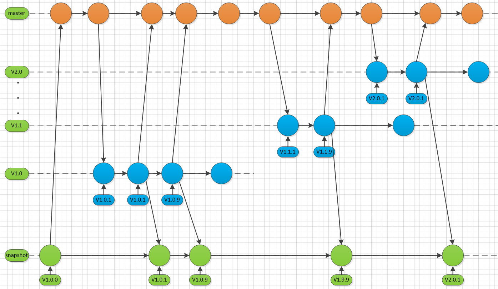
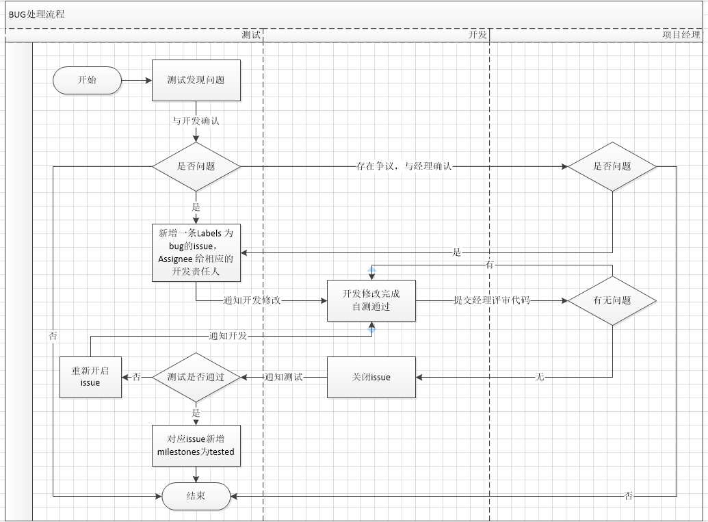

:page-categories: [guide]
:page-tags: [流程与规范]
:author: halley.fang
:doctype: book

软件版本流程与规范

//more

## 项目流程
### 项目流程
.项目流程


### 流程说明
[cols="2,2,6,4",options="header"]
|===
|角色
|阶段
|内容
|交付

1.6+^.^|产品经理
|启动阶段
|1.产品经理进行需求调研
2.完成业务流程梳理
3.界面原型设计
|《需求调研文档》
《需求规格设计说明书》
《产品原型》

|需求阶段
|1.产品经理面向整个团队进行需求宣讲。
2.根据评审意见修改需求规格设计说明书
|《需求规格设计说明书》

|设计阶段
|需求变更
|《需求规格设计说明书》

|开发阶段
|需求变更
|《需求规格设计说明书》

|测试阶段
|需求变更
|《需求规格设计说明书》

|上线阶段
|原则上不再接受需求变更，放入下一个版本
|

1.6+^.^|项目经理
|启动阶段
|1.确认项目组团队组成，包括产品经理、研发项目经理、研发工程师、测试团队等。
2.指定项目计划
3.明确项目管理制度
4.风险评估
|《立项报告》

|需求阶段
|1.需求分析评审
2.研发项目经理根据需求及项目要求，明确项目里程碑，完成项目计划，
3.根据项目计划，进行项目任务分解，完成项目任务分配。
|《项目计划及任务分配》

|设计阶段
|（有单独的开发经理和测试经理则由对应的负责人完成，没有则由项目经理完成或指派责任人完成）
1.概要设计
2.详细设计评审
3.测试设计评审
|《概要设计说明书》

|开发阶段
|项目管理
版本管理
代码评审
|

|测试阶段
|项目管理
版本管理
缺陷评审
|

|上线阶段
|项目管理
|

1.6+^.^|开发工程师
|启动阶段
|
|

|需求阶段
|需求分析评审
|

|设计阶段
|在概要设计的基础上，开发者需要进行软件系统的详细设计。
|《详细设计说明书》

|开发阶段
|1.开发程序代码。
2.功能联调。
3.完成编码后需要进行功能评审，评审通过转测试。
|功能代码
《用户安装手册》
《用户使用指南》

|测试阶段
|开发工程师根据测试提交的bug修改代码，完成后提交测试，测试通过后完成。
|

|上线阶段
|配合上线
|

1.6+^.^|测试工程师
|启动阶段
|
|

|需求阶段
|需求分析评审
|

|设计阶段
|1.测试计划
2.测试分析
|《测试计划》
《测试分析》

|开发阶段
|1.测试用例编写
2.测试脚本开发
|《测试用例》
测试脚本

|测试阶段
|测试工程师按照测试计划和测试用例执行测试，提交bug分配给相应的开发人员调整。
|《用户安装手册》
《用户使用指南》
《测试报告》

|上线阶段
|上线验证
|

1.6+^.^|运维
|启动阶段
|
|

|需求阶段
|
|

|设计阶段
|
|

|开发阶段
|
|

|测试阶段
|
|

|上线阶段
|1.部署软件包
2.与客户确认达成一致后，系统进行试运行，稳定后正式上线。
|

|===

### 评审方式
本文只针对内部评审进行描述：

. 会议评审
将涉及人员集合在一起进行会议评审

. 邮件评审
通过电子邮件附件形式进行评审以及反馈

. 会议与邮件相结合
先进行邮件评审，再进行会议评审

## 版本命名规范
### 版本命名规范
. 稳定版版本号由三部分组成：主板本号，子版本号和阶段版本号，格式为 `1.1.1`，例如：`1.0.0`、`1.0.1`、`2.1.0` 等。其中第一个 `1` 为主版本号，第二个 `1` 为子版本号，第三个 `1` 为阶段版本号

. 预览版版本号由三部分组成：主板本号，子版本号和版本标识，格式为 `1.1-SNAPSHOT`，其中第一个 `1` 为主版本号，第二个 `1` 为子版本号，`SNAPSHOT` 为版本标识

. 测试版本号由四部分组成：主板本号，子版本号，阶段版本号，日期版本号，格式为 `1.1.1.20180725`，其中第一个 `1` 为主版本号，第二个 `1` 为子版本号，第三个 `1` 为阶段版本号，第四部分为日期版本号

### 软件包命名规范
软件包命名由三部分组成：软件名称，版本号，后缀，软件名称和版本号中间用"-"分割。例如 `Softwire-web-1.1.0.jar`，其中软件名称为 `Softwire-web`， `1.1.0` 为版本号， `.jar` 为后缀名。

### 版本文件命名规范
文件名称由四部分组成：第一部分为项目名称，第二部分为文件的描述，第三部分为当前软件的版本号，第四部分为文件后缀，例如：`Softwire` 测试报告 `1.1.adoc`

### 版本号修改规则
. 主版本号
当功能模块有较大的变动，比如增加多个模块或者整体架构发生变化。此版本号由项目决定是否修改。

. 子版本号
相对于主版本号而言，子版本号升级对应的是软件功能有一定的增加或变化，比如增加了对权限控制、增加自定义视图等功能。此版本号由项目决定是否修改。

. 阶段版本号
一般是 `Bug` 修复或是一些小的变动，要经常发布修订版，时间间隔不限，修复一个严重的 `bug` 即可发布一个修订版。此版本号由项目经理决定是否修改。

. 日期版本号
用于记录修改项目的当前日期，每天对项目的修改都需要更改日期版本号。此版本号由开发测试人员决定是否修改


## Git版本管理
团队开发中，遵循一个合理、清晰的 `Git` 使用流程，是非常重要的。否则，每个人都提交一堆杂乱
无章的 `commit` ，项目很快就会变得难以协调和维护。

### 分支管理
`Git` 的一大特点就是可以创建很多分支并行开发。正因为它的灵活性，团队中如果没有一个成熟的
分支模型的话，那将会是一团糟。下面以 `Softwire-web` 为例给出版本分支模型。

`Softwire-web` 分支模型就是给原本普普通通的分支赋予了不同的职责：
```
snapshot——最为稳定功能最为完整的随时可发布的代码；
master——永远是功能最新最全的分支；
V1.0——发布定期要上线的功能；
V2.0——发布定期要上线的功能。
```

.分支模型


### Softwire-web开发过程
. 进入开发阶段后，开发人员在 `master` 分支进行功能开发。
. 功能开发完并自测之后，先将 `master` 最新的代码拉取下来，解决冲突后提交代码
. 代码提交后通知项目经理或开发经理进行代码评审，并通知测试人员对功能进行评审，评审通过后测试打包验证
. 当某个版本所有功能都开发测试完成后，则将版本代码合并到对应版本分支，例如 `V1.0.1`，在 `GitBucket` 创建合并请求( `pull request`)，项目负责人在收到合并请求时，应该先做下代码审核看看有没有明显的严重的错误；有问题就找负责开发的人去修改，没有就接受请求。
. 测试人员在版本分支打包进行测试，若发现了 `bug`，相应的开发人员就在版本分支上或者基于版本分支创建一个分支进行修复。（到达该步骤后 `master` 上不允许再提交代码，只能在版本分支修改）
. 当确保某次发布的功能可以发布时，开发人员将版本分支合并进 `master` 和 `snapshot` 并打上 `tag`，然后打包发布到线上环境。建议打 `tag` 时在信息中详细描述这次发布的内容，如：添加了哪些功能，修复了什么问题。`tag` 采用语义化版本命名(参考版本号语义化格式)
+
[NOTE]
====
. 当某个版本需要定制开发时，需要开发者新建一个定制分支，从 `snapshot` 拉取对应的基础版本代码，后续开发流程与上述一致
. 当主板本升级后，历史版本分支则进入独立状态，基于历史版本进行的开发或修改不能再往 `master` 合并，若 `master` 也需要修改则独立修改 `master` 分支
====

### Softwire git库
目前 Softwire 源代码 Git 仓库总共有 3 个：

* `Softwire-super-pom`
* `Softwire-starter`
* `Softwire-web`

每个 Git 仓库下的分支都是：

* 一个开发分支 `master`。
* 一个预览版分支 `snapshot`。
+
[NOTE]
====
`snapshot` 分支上不会有任何提交，只会在确定 `master` 分支上某个 Commit 是可用的情况下，“快进合并”（fast forward）到该 Commit。

也就是说强制快进合并一定可以成功：

```
git checkout snapshot
git merge --ff-only master
```
====

* 多个稳定版分支，例如 `1.0.x`、`1.1.x`、`2.1.x` 等。


### 变更管理


* 所有变更都变更在 GitBucket 中添加 Issue。原则上来讲，不允许不关联任何 Issue 的 Commit，除非只是添加一些注释或调整一下格式等小改动。

* 变更分为新特性和 Bug 两大类。所有新特性变更必须由变更设计小组讨论后确定设计方案，并写入 Issue。如果是比较大的变更，还应撰写单独的设计文档。
+
变更处理人应尽可能参与变更讨论、设计的过程，以便有更深刻的理解。

* 变更管理委员会要确定该变更需要在哪些分支中提供。具体操作方法是为该 Issue 添加多个以分支名命名的 Label。注意：变更类型（`task`、`enhancement`、`bug`）也是 Label。

* 开发人员解决变更后，关闭该变更。该变更状态从 `Open` 变为 `Closed`。
+
[NOTE]
====
开发人员解决变更过程中必须要做的事情：

* 写代码
+
如果是稳定版分支上存在的 Bug，则尽量在稳定版分支上开发。

* 把代码合并到其他存在该 Bug 的分支（包括其他稳定版分支和 `master` 分支）上，除非是已经宣布不再维护升级的分支。

* 写发布说明
* 给出一个示例
* 撰写示例说明文档
* 撰写参考指南文档
* 有些变更还需纳入常见问题，撰写常见问题文档
* 如果有必要的话，撰写教程文档
====

* 建一个名为 `tested` 的 Milestone。
+
测试人员在测试变更通过后，把该 Issue 的 Milestone 设置为 `tested`，Issue 的状态仍然保持 `Closed` 不变。若测试不通过，则把该 Issue 的状态改回 `Open`。


### 稳定版分支与master的合并

* 一般都是某个 Bug 先在稳定版分支开发，然后再合并到其他稳定版分支以及 `master` 分支。

* 但如果 `master` 上的代码已经做了比较大的结构改动，则可能无法依靠 Git 的 Merge 功能就把一切都搞好。
+
这时可能就要直接在 `master` 上重新开发。但这种做法一旦出现，则日后再有其他代码变更，也很难再合并了。这是一个比较大的风险，在处理时需谨慎。

* 在各个分支之间做合并时，只允许使用 `merge`，不允许使用 `rebase`。
+
但各人自己开发的代码，要合并到 `master` 等分支时，鼓励使用 `rebase`。


### "前瞻性"文件维护
#### 开发分支 master

在稳定版分支建立之前，就要在 `master` 中“前瞻性”地维护“未来将要建立的分支”的说明文件。

* 起始版本：
** 最开始只有 `master` 分支，在 `release-notes.adoc` 文件中先写上起始版本号，本质上就是记录当时的 Commit 号。从这个 Commit 号开始，之后所有的变化都要写发布说明。

** 然后增加下个稳定版分支建立之前的预览版本标题 `0.9-SNAPSHOT` 标题，并提交。以后每次发生变化都需要增加该标题下的描述。

* 等到要从 `master` 分出稳定分支 `0.9.x` 时：

** `master` 分支的 `release-notes.adoc` 文件中，标题 `0.9-SNAPSHOT` 改为 `0.9.0`，并提交（假设 Commit 号为 `abc001`）。
** 从 Commit `abc001` 建立分支 `0.9.x`，并在该 Commit 上打上 tag `0.9.0`。发布时就发布 `0.9.0` 这个 tag。

* `master` 分支发生变化后：
+
要在 `release-notes` 文件中增加新的 `1.0-SNAPSHSOT` 标题，并在该标题下写发布说明。

#### 稳定版分支

稳定版分支也要持续维护 `release-notes.adoc` 文件。

* `0.9.x` 分支发生变化后：
** 要在 `release-notes` 文件中增加新的标题（一开始就是 `0.9.1`），并在该标题下写发布说明。
** 通常还需要把 `0.9.x` 上的 Commit 合并到其他分支，合并时应把 `0.9.1` 标题放在其他分支 `release-notes` 文件的第一个标题之后，比如放在 `master` 分支 `release-notes` 文件的`1.0-SNAPSHSOT` 标题之后。
** 假设当期存在多个在维护的稳定分支（`0.9.x`、`1.0.x`、`1.1.x`、`2.0.x`），则一般操作顺序是：先从 `0.9.x` 合并到 `1.0.x`，再从 `1.0.x` 合并到 `1.1.x`，再从 `1.1.x` 合并到 `2.0.x`。

* 等到要发布 `0.9.1` 版本时：
+
在 `0.9.x` 分支的最新 Commit 上打上 tag `0.9.1`。发布时就发布 `0.9.1` 这个 tag。

### 现有 Git 库结构调整（已经完成）

* 合并 `Softwire-core` 和 `Softwire-web`：

** 把 `Softwire-core` 的源代码直接复制到 `Softwire-web` 中
** 不再使用 `Softwire-core`，仅用于查看在此之前的 commit

* 调整 `Softwire-starter` 和 `Softwire-web` 之间的依赖关系：

** 把 `Softwire-web` 的 `pom.xml` 中的 `<dependencies>` 全部删除，转而写进 `Softwire-super-pom` 的 `pom.xml`
** `Softwire-starter` 的 `pom.xml` 去除对 `Softwire-web` 的依赖

### 提交(Commit)
#### Commit规范
. Commit Message 格式
+
```
<IssueID> <type>:<subject>
<空行>
<body>
```
上面是一次Commit后Message格式规范，分成标题，内容详情，结尾三个部分，各有各的用处，没有多余项。不管是哪一个部分，任何一行都不得超过72个字符（或100个字符）。这是为了避免自动换行影响美观。
+
头部即首行，是可以直接在页面中预览的部分，入上面图中所示，一共有三个部分<IssueID>，<type>，<subject>。

. Type
```
*    feat :新功能
*    fix :修复bug
*    doc :文档改变
*    style :代码格式改变
*    refactor :某个已有功能重构
*    revert :撤销上一次的 commit
```

. Subject
用来简要描述本次改动，概述就好了，因为后面还会在Body里给出具体信息。并且最好遵循下面三条:
+
```
* 以动词开头，使用第一人称现在时，比如change，而不是changed或changes
* 首字母不要大写
* 结尾不用句号(.)
```

. Body
<body>里的内容是对上面subject里内容的展开，在此做更加详尽的描述，内容里应该包含修改动机和修改前后的对比。
+
[NOTE]
====
有两个注意点:

. 使用第一人称现在时，比如使用change而不是changed或changes。
. 应该说明代码变动的动机，以及与以前行为的对比。
====

. Revert
此外如果需要撤销之前的Commit，那么本次Commit Message中必须以revert：开头，后面紧跟前面描述的Header部分，格式不变。并且，Body部分的格式也是固定的，必须要记录撤销前Commit的SHA值。

#### 设置模板
. 在根目录建立模板文件
如 xxx_template文件，其内容如下：
+
```
issueid type:subject

body
```

. 设置模板，命令如下
git config commit.template   [模板文件名]    //这个命令只能设置当前分支的提交模板
git config --global commit.template   [模板文件名]    //这个命令能设置全局的提交模板
例如：
+
```
git config commit.template xxx_template
git config --global commit.template xxx_template
```

. 设置文本编辑器，命令如下：
git config --global core.editor  [编辑器名字]
例如：
+
```
git config --global core.editor vi
```

. 编辑模板提交代码，命令如下
+
```
git commit
```
+
[NOTE]
====
注意：
. git commit之前先要使用  git add  将没有入库的代码入库
. 可以使用 git  commit  -a 提交多个代码文件
====

. 在第四步之后，会以设置的编辑器打开模板文件，然后按照格式修改该文件，并保存

. 提交代码到远程分支
+
```
git push
```

## BUG管理
### GitBucket issue使用

. 所有变更都变更在 GitBucket 中添加 Issue。原则上来讲，不允许不关联任何 Issue 的 commit，除非只是添加一些注释或调整一下格式等小改动。

. 变更分为新特性和 Bug 两大类。所有新特性变更必须由变更设计小组讨论后确定设计方案，并写入 Issue。如果是比较大的变更，还应撰写单独的设计文档。

. 变更管理委员会要确定该变更需要在哪些分支中提供。具体操作方法是为该 Issue 添加多个以分支名命名的 Label。注意：变更类型（task、enhancement、bug）也是 Label。

. 建一个名为 tested 的 Milestone。测试人员在测试变更通过后，把该 Issue 的 Milestone 设置为 tested。

### bug处理流程
.bug流程


流程说明：

. 测试人员发现bug并与开发人员确认是否bug(意见分歧则上升到项目经理或产品经理确认)，
. 确认是bug则创建问题单，新增一条Labels 为bug的issue，Assignee 给相应的开发责任人，问题单需要符合规范(下文有规范说明)
. 开发人员修改bug，修改完后自测OK，代码评审OK后将issue关闭，提交给测试人员进行回归测试
. 测试人员对close状态的issue进行回归测试，测试ok则对应issue新增milestones为tested
. 回归测试失败则重新开启issue，通知开发人员重新修改
+
[NOTE]
====
以下场景需要进行问题单回溯
1.存在重新开启动作的问题单
2.漏测问题单(评定标准:版本上线后发现的设计遗漏或者测试遗漏导致的问题)
====

### bug规范
. 标题(title)
.. 标题由"头信息+简述"组成；
.. 头信息包括版本号、测试阶段、模块功能；
.. 简述是对缺陷或者错误特征的简要描述，要求简练、准确、直切主题
.. 标题示例：
+
```
【V1.0.1】【SIT】【系统配置】系统配置XX功能XX操作出现XX错误
```
+
[NOTE]
====
. 对历史版本的问题测试阶段可以写【OLD】标识
. 重新开启的issue新增【打回】标识
====

. 描述(comment)
.. 说明区域包括：步骤、预计结果、实际结果、测试环境、bug出现时间、截图、日志
.. 不同的操作步骤产生不同的问题，需分别报bug,尽量做到一个bug汇报一个问题；
.. 描述示例：
+
```
【测试用例】用例编号、用例名称
【操作步骤】1.XXX
           2.XXX
【预期结果】xxx
【实际结果】xxx
【详细描述】测试环境、bug出现时间、截图、日志
```
. 分类(Labels)
分类选择bug

. 级别(Priority)
级别简要说明
+
```
* highest 致命：bug导致服务功能不可用等
* high    严重：功能实现与需求不符、bug导致测试阻塞等
* medium  一般：功能缺陷
* low     提示：提示信息、页面布局等
* lowest  建议：用户体验性等改善建议
```
. 责任人(assignee)
将问题单指派给开发责任人

. 问题处理
开发人员解决BUG时需要写明以加内容：
* bug原因
* bug修改方法
* bug可以在哪个版本进行验证


## 发布说明
### Softwire 版本与 jar 文件的关系
Softwire 平台发布内容的本质就是几个 jar 文件和一份发布说明文档，目前包括：

* `Softwire-starter.jar`
* `Softwire-web.jar`
* `release-notes.html`

### Release Notes
在 `Softwire-web` 库中每个分支都持续维护一个发布说明文件（Release Notes），文件名为 `release-notes.adoc`。
该文件中应按照版本号倒序列出每个版本（`1.0.2`、`1.0.1`、`1.0.0`）的描述，每个版本号使用二级标题（`##`）。
每个版本的描述可包含以下几个小节，每个小节使用三级标题（`###`）：

* 升级指导，包括：
** 升级后要手工做的一些数据库、Redis 处理
** 兼容性发生变化的部分，比如 `application.properties` 中某个选项的默认值发生了变化，可能导致现有项目升级后出现问题

* 新特性（New Feature）

* 修复（Bug Fix）

* 非功能性变更，包括：
** 依赖包版本升级

* 遗留问题以及变通方案
