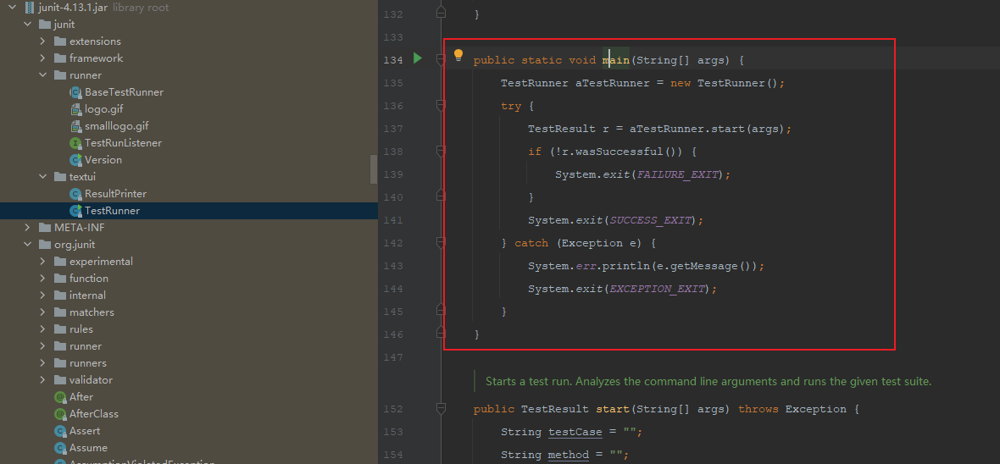
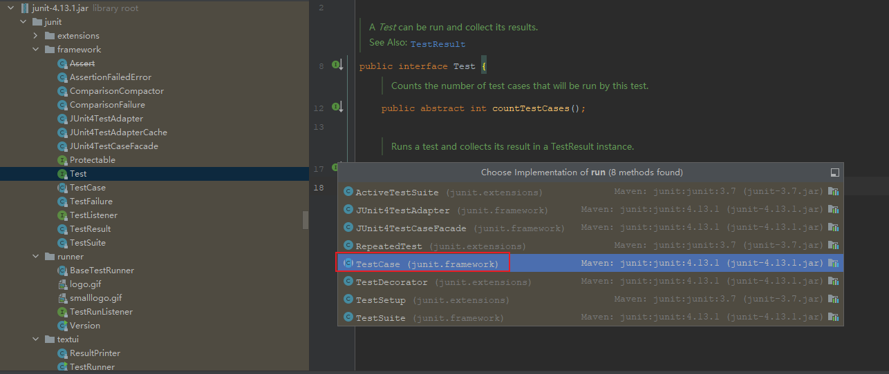

:page-categories: [junit]
:page-tags: [junit,源码阅读]
:author: halley.fang
:toc:
:toclevels: 5
:numbered:
:hardbreaks:
:doctype: book

Junit 4 源代码阅读笔记-textui.TestRunner

//more

## 源码解读

### 加载->运行

首先找到junit的入口类

.main方法


```java
public static void main(String[] args) {
    TestRunner aTestRunner = new TestRunner();
    try {
      //start传入测试类
        TestResult r = aTestRunner.start(args);
        if (!r.wasSuccessful()) {
            System.exit(FAILURE_EXIT);
        }
        System.exit(SUCCESS_EXIT);
    } catch (Exception e) {
        System.err.println(e.getMessage());
        System.exit(EXCEPTION_EXIT);
    }
}
```

start分析命令行参数并运行测试类的suite

```java
public TestResult start(String[] args) throws Exception {
        String testCase = "";
        String method = "";
        boolean wait = false;

        for (int i = 0; i < args.length; i++) {
            if (args[i].equals("-wait")) {
                wait = true;
            } else if (args[i].equals("-c")) {
                testCase = extractClassName(args[++i]);
            } else if (args[i].equals("-m")) {
                String arg = args[++i];
                int lastIndex = arg.lastIndexOf('.');
                testCase = arg.substring(0, lastIndex);
                method = arg.substring(lastIndex + 1);
            } else if (args[i].equals("-v")) {
                System.err.println("JUnit " + Version.id() + " by Kent Beck and Erich Gamma");
            } else {
                testCase = args[i];
            }
        }

        if (testCase.equals("")) {
            throw new Exception("Usage: TestRunner [-wait] testCaseName, where name is the name of the TestCase class");
        }

        try {
            if (!method.equals("")) {
                return runSingleMethod(testCase, method, wait);
            }
            //初始化，获取testSuite
            Test suite = getTest(testCase);
            //测试运行
            return doRun(suite, wait);
        } catch (Exception e) {
            throw new Exception("Could not create and run test suite: " + e);
        }
    }
```

```java
public Test getTest(String suiteClassName) {
        if (suiteClassName.length() <= 0) {
            clearStatus();
            return null;
        }
        Class<?> testClass = null;
        try {
          //根据类名获取测试类信息
            testClass = loadSuiteClass(suiteClassName);
        } catch (ClassNotFoundException e) {
            String clazz = e.getMessage();
            if (clazz == null) {
                clazz = suiteClassName;
            }
            runFailed("Class not found \"" + clazz + "\"");
            return null;
        } catch (Exception e) {
            runFailed("Error: " + e.toString());
            return null;
        }
        Method suiteMethod = null;
        try {
          //获取所有测试方法信息
            suiteMethod = testClass.getMethod(SUITE_METHODNAME);
        } catch (Exception e) {
            // try to extract a test suite automatically
            clearStatus();
            //没有通过getMethod方法拿到suiteMethod的话，就会调用TestSuite构造器
            return new TestSuite(testClass);
        }
        if (!Modifier.isStatic(suiteMethod.getModifiers())) {
            runFailed("Suite() method must be static");
            return null;
        }
        Test test = null;
        try {
            test = (Test) suiteMethod.invoke(null); // static method
            if (test == null) {
                return test;
            }
        } catch (InvocationTargetException e) {
            runFailed("Failed to invoke suite():" + e.getTargetException().toString());
            return null;
        } catch (IllegalAccessException e) {
            runFailed("Failed to invoke suite():" + e.toString());
            return null;
        }

        clearStatus();
        return test;
    }
```

```java
public TestSuite(final Class<?> theClass) {
        addTestsFromTestCase(theClass);
    }

    private void addTestsFromTestCase(final Class<?> theClass) {
        fName = theClass.getName();
        try {
            getTestConstructor(theClass); // Avoid generating multiple error messages
        } catch (NoSuchMethodException e) {
            addTest(warning("Class " + theClass.getName() + " has no public constructor TestCase(String name) or TestCase()"));
            return;
        }

        if (!Modifier.isPublic(theClass.getModifiers())) {
            addTest(warning("Class " + theClass.getName() + " is not public"));
            return;
        }

        Class<?> superClass = theClass;
        List<String> names = new ArrayList<String>();
        //判断superClass是不是Test类的子类
        while (Test.class.isAssignableFrom(superClass)) {
          //用迭代的形式从被测试的类开始，到被测试的类继承的TestCase，最后到Object类，这个循环从这几个类中所有符合条件的测试方法加入到名为names的list中
            for (Method each : MethodSorter.getDeclaredMethods(superClass)) {
                addTestMethod(each, names, theClass);
            }
            superClass = superClass.getSuperclass();
        }
        if (fTests.size() == 0) {
            addTest(warning("No tests found in " + theClass.getName()));
        }
    }
```

```java
private void addTestMethod(Method m, List<String> names, Class<?> theClass) {
        String name = m.getName();
        if (names.contains(name)) {
            return;
        }
        //判断是否public，非public判断为true
        if (!isPublicTestMethod(m)) {
          //判断非public方法是否startsWith("test")
            if (isTestMethod(m)) {
                addTest(warning("Test method isn't public: " + m.getName() + "(" + theClass.getCanonicalName() + ")"));
            }
            return;
        }
        names.add(name);
        addTest(createTest(theClass, name));
    }
```

至此测试方法初始化完成，接下来就是 `dorun`

```java
public TestResult doRun(Test suite, boolean wait) {
    TestResult result = createTestResult();
    //添加结果打印监听
    result.addListener(fPrinter);
    //开始执行时间
    long startTime = System.currentTimeMillis();
    //执行测试
    suite.run(result);
    //执行结束时间
    long endTime = System.currentTimeMillis();
    //执行耗时
    long runTime = endTime - startTime;
    fPrinter.print(result, runTime);

    pause(wait);
    return result;
}
```

.test run实现


```java
public void run(TestResult result) {
  //执行TestResult run
    result.run(this);
}
```

```java
protected void run(final TestCase test) {
  //开始执行
    startTest(test);
    Protectable p = new Protectable() {
        public void protect() throws Throwable {
            //test执行方法
            test.runBare();
        }
    };
    //调用执行并获取测试结果
    runProtected(test, p);
    //执行结束
    endTest(test);
}
```

```java
public void runBare() throws Throwable {
        Throwable exception = null;
        //执行前置
        setUp();
        try {
            //调用执行方法
            runTest();
        } catch (Throwable running) {
            exception = running;
        } finally {
            try {
                //执行后置
                tearDown();
            } catch (Throwable tearingDown) {
                if (exception == null) exception = tearingDown;
            }
        }
        if (exception != null) throw exception;
    }

    protected void runTest() throws Throwable {
        assertNotNull("TestCase.fName cannot be null", fName); // Some VMs crash when calling getMethod(null,null);
        Method runMethod = null;
        try {
            // use getMethod to get all public inherited
            // methods. getDeclaredMethods returns all
            // methods of this class but excludes the
            // inherited ones.
            runMethod = getClass().getMethod(fName, (Class[]) null);
        } catch (NoSuchMethodException e) {
            fail("Method \"" + fName + "\" not found");
        }
        if (!Modifier.isPublic(runMethod.getModifiers())) {
            fail("Method \"" + fName + "\" should be public");
        }

        try {
            //执行
            runMethod.invoke(this);
        } catch (InvocationTargetException e) {
            e.fillInStackTrace();
            throw e.getTargetException();
        } catch (IllegalAccessException e) {
            e.fillInStackTrace();
            throw e;
        }
    }
```
