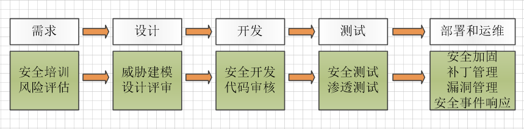
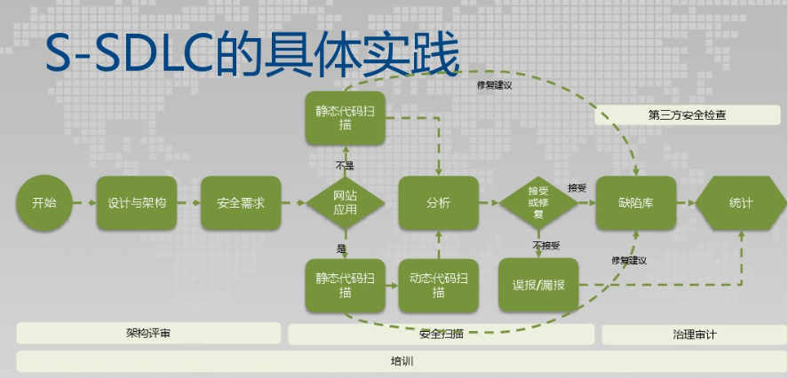
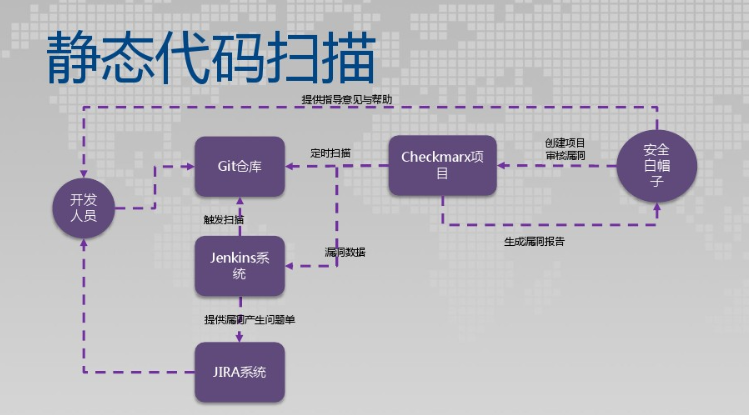
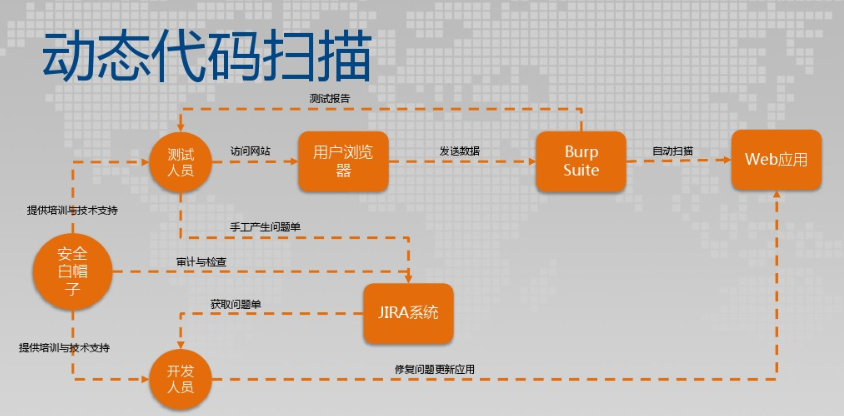

:page-categories: [guide]
:page-tags: [流程与规范]
:author: halley.fang

随着全球各地的组织越来越依赖软件控制来保护其计算环境以及云和内部环境中的数据，软件安全性保证问题变得日益重要。 安全事故导致的潜在成本、日益复杂的法规要求以及随时更新安全补丁带来的持续运营成本，促使组织认真考虑如何保障软件安全以及评估其技术供应商的安全保障实践。

//more

公司将软件安全性保证贯穿到产品开发生命周期的所有阶段，通过这种方法向其产品的设计、构建、测试和维护流程融入安全性。 公司的目标是确保产品能够帮助客户满足其安全要求，同时提供具有成本效益的所有权体验。

## 安全软件开发流程
如图<<Figure1>>所示，我们将安全工作贯穿到整个软件开发生命周期中

[[Figure1]]
.安全开发

在整个开发生命周期中，我们安全工作具体流程简略概括如<<Figure2>>，下文将详细介绍在每个阶段我们的安全工作内容和方法

[[Figure2]]
.具体实践流程

### 需求阶段安全保证
#### 安全培训
安全的软件不会自发形成， 它需要企业在整个组织范围始终如一地应用相同的方法，而这些方法应符合规定的政策、目标和原则。 其中，目标是生成安全的代码，政策是指所有开发应遵守现已制定、传达并且已对员工进行过培训的安全编码原则。为了确保产品开发始终具备高安全性保证，帮助开发人员远离常见的编码错误，公司采用了一系列正式的安全编码标准。安全编码标准为开发人员的安全编码工作提供了一个路线图和指南， 它们涵盖了设计准则、常见漏洞等一般安全知识，并就数据验证、数据隐私、 `CGI` 、用户管理等主题提供了具体指导。

公司所有开发人员都应熟悉并将这些标准应用于产品设计和构建工作。 此外，这些编码标准经过了多年发展，不仅融入了优秀实践，还不断纳入了我们内部产品评估团队在漏洞测试中总结下来的经验。 对此，公司要求所有开发人员都参加安全编码培训，确保他们熟悉企业的编码标准。 安全编码标准是软件安全性保证的关键组成部分，产品在有效寿命期间都要依据安全编码标准进行评估和验证。

多年以来，公司在企业内部基于安全编码标准， 持续面向其产品开发组织（包括开发人员和产品管理、版本管理以及质量保证人员）开展培训。 而且，这些培训不仅仅局限于专业人士，还扩展到了经理以上（包括副总裁）的企业人员。 这种持续的教育可确保开发人员全方位彻底地熟悉安全编码，了解公司为打造高品质产品设立高标准的初心。

#### 风险评估
根据最新的统计结果，超过 `70%` 的安全漏洞出现在应用层而不是网络层，而且不只发生在操作系统或者 `web` 浏览器，而发生在各种应用程序中，特别是关键的业务系统中。我们对系统应用软件进行安全风险评估，根据评估结果，预先采取防范措施，预防或缓解各种可能出现的信息数据安全风险。这种基于风险的评估方法促进有针对性的在后续开发过程中处理已识别的安全风险。

我们对以下信息进行风险评估：

. 项目的哪些部分在发布前需要威胁模型？
. 项目的哪些部分在发布前需要进行安全设计评析？
. 项目的哪些部分需要进行渗透测试？
. 模糊测试要求的具体范围是什么？
. 隐私影响评级如何？

### 设计阶段安全保证
#### 威胁建模
威胁建模是一套过程：首先要通过识别各种目标对象的漏洞来优化网络、应用以及互联网安全，然后确定应对的措施，从而防范或缓解威胁对系统的影响。威胁是一种具有恶意(如DoS攻击)或偶然(信息泄漏)性质的，潜在或实际存在的不良事件。因此威胁建模就是一个识别和评估应用程序威胁与漏洞的活动计划。我们在持续的威胁建模过程中针对 `Web` 应用程序制定和实施一套安全框架来缓解威胁。`Web` 应用程序的威胁建模有关的主要步骤如下：

. 安全目标的识别
. 资产的识别
. 应用程序的排查
. 系统建模
. 威胁的识别
. 漏洞的识别
. 威胁代理的选择
. 威胁历史的检查
. 资产和漏洞的优先级排序
. 威胁影响的分析

#### 设计评审
针对设计进行安全评审，评审内容包括但不仅限于以下内容：

. 安全设计评审
. 软件需求规格设计安全性分析
. 软件结构设计安全性分析
. 软件详细设计安全性分析
. 软件测试设计安全性分析

### 开发阶段安全保证
#### 安全开发
. 严格按照安全编程规范进行编码
. 开发团队使用的编辑器、链接器等相关工具，需要使用经过公司安全部门审核允许的工具，不得擅自使用非法来源的工具
. 禁用不安全的函数和API，使用安全团队推荐的函数

#### 代码审核

. 代码评审机制
我们非常重视代码评审，通过会议评审、结对评审等有效的评审机制保证代码质量。

. 代码静态分析如图<<Figure3>>，使用相关工具辅助完成代码静态分析，其结果与人工分析相结合。我们使用静态扫描工具例如Findbugs进行静态分析，并有一套完整高效的问题提交和分析解决流程。

[[Figure3]]
.静态分析

### 测试阶段安全保证
#### 安全测试
. 安全测试用例执行
[[安全用例]]
测试用例覆盖但不仅限于以下安全测试内容：
* XSS跨站脚本攻击
* 点击劫持
* XXE
* SSRF 服务器端请求伪造
* CORS 跨域资源共享
* URL跳转漏洞
* url访问限制
* 注入攻击
* 文件上传
* 文件包含
* 目录遍历
* 写接口限制测试
* web应用返回敏感信息（不安全对象引用）
* 信息泄露和不正确的错误处理
* session token Cookie安全
* 暴力破解、字典攻击
* 不安全的木马存储（过于简单的加密技术导致破译密码）
* 不安全的通讯（敏感信息未加密）
* 缓冲区溢出
* 输入验证
* 输出编码
* 注册功能
* 登录功能
* 验证码功能
* 忘记密码功能
* 密码安全性要求

. 安全工具扫描进行动态分析
动态扫描流程如图<<Figure4>>,我们使用动态扫描工具例如BurpSuit进行动态测试，并有一套完整高效的问题提交和分析解决流程。

[[Figure4]]
.动态分析

#### 渗透测试
使用工具进行渗透测试攻击，攻击内容同样覆盖<<安全用例>>内容

### 部署和运维阶段安全保证
#### 安全加固
当客户将软件系统从开发测试环境转移到生产环境时，通常采取一个称为"加固"的流程。 加固的目标是减少生产系统遭到攻击的漏洞数量。 这个流程一般包括：保障底层网络和平台的安全、限制用户权限、移除不必要的功能、关闭可有可无的系统访问，比如未使用过的用户帐户或网络端口。 我们的安全配置计划专注于确保产品提供现成的理想安全状态，客户只需很少操作甚至不需要操作即可进一步"加固"产品。

#### 自动化部署
我们的软件部署过程的每一个步骤都自动化，通过标准化、一致、可扩展、可重复且安全的流程保证快速交付的可靠性和安全性。

#### 补丁管理
. 补丁更新计划
我们的产品安全漏洞修复程序的除错修补机制是参照 `CVSS` 补丁级别定义进行更新计划，风险水平最高的问题会优先得到修复：

* 一级补丁在系统变更确认之日起1周内更新：该级别是针对易被未授权的远程攻击者入侵并会削弱系统功能（比如任意执行代码）却不会要求用户响应的漏洞。这些类型的漏洞会遭受蠕虫病毒的入侵。对于远程用户及本地用户需要获得访问授权的漏洞，或是难以入侵配置的漏洞，不属于有严重影响的漏洞。

* 二级补丁在系统变更确认之日起4周内更新：该级别是针对易于削弱资源的机密性、完整性或可用性的漏洞。这些类型的漏洞会让本地用户获得权限，让未经授权的远程用户查看本应获得授权保护的资源，让获得授权的远程用户执行任意代码，或让本地或远程用户拒绝服务。

* 三级补丁在系统变更确认之日起24周内：该级别是针对难以入侵但在某些情况下仍会部分削弱资源的机密性、完整性或可用性的漏洞。根据对漏洞的技术评估，这些类型的漏洞具有严重的或重要的影响，但不易遭受入侵，或者会影响不太可能遭受入侵的配置。

* 四级补丁在后续某个正式版本中进行更新：该级别是针对有一定安全影响的所有其他问题。这些类型的漏洞会产生不太可能遭受入侵的情况，或者即使成功入侵也只是产生最小的后果。

. 安全修复和补丁包
安全修复也会在补丁包（或同等程序包）和新产品版本中提供。

. 补丁更新文档
每个重要补丁更新均以通告作为头号文档。 该通告会提供受影响的产品清单，并包含每个产品套件的风险表。风险表中提供的信息可帮助客户评估在其特定环境下安全漏洞所带来的风险。可以利用这些风险表来识别风险程度较高的系统，以便先修补它们。 重要补丁更新中修复的每个新安全漏洞均会列在风险表的受影响产品中。

. 补丁更新发布前公告
在每个补丁更新的发布日之前的周四，我们将会发布重要补丁更新文档的一份摘要。 这份摘要称为重要补丁更新发布前公告，它预先提供了关于即将发布的重要补丁更新的一些信息：

* 补丁更新中修复的新漏洞所影响的产品的名称和版本号

* 各产品套件的安全修复数

* 各产品套件的最高 `CVSS` 基础分值

+
此外，还可能包括有助于组织在其环境中规划应用关键补丁更新的其他相关信息

#### 漏洞管理
为了避免给客户带来不必要的风险，我们将在提供补丁更新公告的同时提供其他具体漏洞信息。我们对于其他漏洞信息的获知方式包括但不仅限于以下方式：

* 来自软、硬件厂商和国际、国内知名安全组织的安全通告。
* 公司信息安全部门工作人员的渗透测试结果及安全评审意见。
* 使用安全漏洞评估工具扫描。
* 来自单位合作的安全厂商或友好的外部安全组织给出的漏洞通知。

此外，我们对所有客户提供同样的保护，因此为所有客户提供同样的信息。 我们不会对个别客户提供预先通知， 也不会在产品中开发或发布漏洞的主动利用代码（或概念验证代码）。

#### 安全事件响应
发现安全事件后,我们将在24-48小时内按以下阶段迅速处理解决：

. 阶段1：初步确定波及范围和严重程度，进行事件的初始分类，保全第一手证据，激活事件反应小组，并按需引入相关领域的专家。
. 阶段2：通过进行调查与取证，识别根本原因并着手恢复。
. 阶段3：全面制定执行抑制策略与步骤，采取措施来根除风险，使信息、资产和基础设施恢复正常运转。
. 阶段4：将事件全部过程通知到管理层;从公司形象角度配合公关和外部通信。
. 阶段5：将安全事件和恢复过程进行最终文档化，在放置复发的同时，以供监管部门的检查和必要的诉讼。
