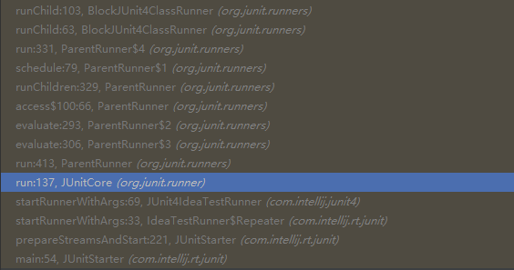

:page-categories: [jnuit]
:page-tags: [jnuit,源码阅读]
:author: halley.fang
:toc:
:toclevels: 5
:numbered:
:hardbreaks:
:doctype: book

Junit 4 源代码阅读笔记 - BlockJUnit4ClassRunner

//more

## Junit4 源码阅读

阅读方向：根据对 `Junit4` 的使用，首先是如何加载并运行测试，然后是一些常用注解

junit4执行加载器默认为 `BlockJUnit4ClassRunner`，平时测试时我经常使用的是 `SpringRunner`、`MockitoJUnitRunner`、`PowerMockRunner` 等，具体使用方式为使用类注解@RunWith,本文中以默认加载器进行解读，其他几个常用 `runner` 后续进行单独解读。

. idea 调用入口
+
.idea调用

+
可以看出 `idea` 插件实际调用到了 `JUnitCore` 类的 `run` 方法，下文就直接从该方法开始往下阅读
+
```java
//创建一个RunNotifier对象以告知Junit执行测试的进展
private final RunNotifier notifier = new RunNotifier();

public Result run(Runner runner) {
    //创建result对象
    Result result = new Result();
    //创建RunListener
    RunListener listener = result.createListener();// <1>
    //添加监听
    notifier.addFirstListener(listener);// <2>
    try {
        //初始化测试Description
        notifier.fireTestRunStarted(runner.getDescription());// <3>
        //runner运行
        runner.run(notifier);// <4>
        //执行所有的监听器处理执行结果
        notifier.fireTestRunFinished(result);// <5>
    } finally {
        //移除监听
        removeListener(listener);// <6>
    }
    //返回结果
    return result;
}
```
<1> 详见下文 `createListener`
<2> 详见下文 `addFirstListener`
<3> 详见下文 `Description` 和 `fireTestRunStarted`
<4> 详见下文 `runner.run`
<5> 详见下文 `fireTestRunFinished`
<6> 详见下文 `removeListener`

. createListener
+
```java
public RunListener createListener() {
    return new Listener();
}

@RunListener.ThreadSafe
    private class Listener extends RunListener {
        //测试程序开始执行
        @Override
        public void testRunStarted(Description description) throws Exception {
            startTime.set(System.currentTimeMillis());
        }

        //测试程序执行完成
        @Override
        public void testRunFinished(Result result) throws Exception {
            long endTime = System.currentTimeMillis();
            runTime.addAndGet(endTime - startTime.get());
        }

        //一个测试方法执行完成
        @Override
        public void testFinished(Description description) throws Exception {
            count.getAndIncrement();
        }

        //一个测试方法执行失败
        @Override
        public void testFailure(Failure failure) throws Exception {
            failures.add(failure);
        }

        //一个测试方法执行忽略
        @Override
        public void testIgnored(Description description) throws Exception {
            ignoreCount.getAndIncrement();
        }

        //若测试方法因调用 Assume 类中的方法失败（这种失败不认为是测试失败），则会发布 testAssumptionFailure 事件
        @Override
        public void testAssumptionFailure(Failure failure) {
            assumptionFailureCount.getAndIncrement();
        }
    }
```

. addFirstListener
+
```java
public void addFirstListener(RunListener listener) {
    //没有监听器则抛出异常
    if (listener == null) {
        throw new NullPointerException("Cannot add a null listener");
    }
    //添加第一个监听器
    listeners.add(0, wrapIfNotThreadSafe(listener));
}

RunListener wrapIfNotThreadSafe(RunListener listener) {
    //返回RunListener.ThreadSafe注解类的监听器对象
    return listener.getClass().isAnnotationPresent(RunListener.ThreadSafe.class) ?
            listener : new SynchronizedRunListener(listener, this);
}
```

. Description
+
`runner.getDescription()`
+
```java
public Description getDescription() {
       Class<?> clazz = getTestClass().getJavaClass();
       Description description;
       // if subclass overrides `getName()` then we should use it
       // to maintain backwards compatibility with JUnit 4.12
       if (clazz == null || !clazz.getName().equals(getName())) {
           description = Description.createSuiteDescription(getName(), getRunnerAnnotations());
       } else {
           description = Description.createSuiteDescription(clazz, getRunnerAnnotations());
       }

       //遍历所有@Test的方法
       for (T child : getFilteredChildren()) {
           //测试类添加child（测试方法）
           description.addChild(describeChild(child));
       }
       return description;
   }
```
+
```java
private Description(Class<?> testClass, String displayName, Serializable uniqueId, Annotation... annotations) {
        if ((displayName == null) || (displayName.length() == 0)) {
            throw new IllegalArgumentException(
                    "The display name must not be empty.");
        }
        if ((uniqueId == null)) {
            throw new IllegalArgumentException(
                    "The unique id must not be null.");
        }
        //测试类
        this.fTestClass = testClass;
        //测试类名称
        this.fDisplayName = displayName;
        //description唯一标识，默认为测试类名称
        this.fUniqueId = uniqueId;
        //测试方法注解
        this.fAnnotations = annotations;
    }
```
+
```java
private List<T> getFilteredChildren() {
    if (filteredChildren == null) {
        childrenLock.lock();
        try {
            if (filteredChildren == null) {
                //获取所有的测试方法
                filteredChildren = Collections.unmodifiableList(
                        new ArrayList<T>(getChildren()));
            }
        } finally {
            childrenLock.unlock();
        }
    }
    return filteredChildren;
}
```
+
getChildren最终会调用computeTestMethods
+
```java
protected List<FrameworkMethod> computeTestMethods() {
    //返回所有@Test注解的方法
    return getTestClass().getAnnotatedMethods(Test.class);
}
```
+
```java
private final ConcurrentMap<FrameworkMethod, Description> methodDescriptions = new ConcurrentHashMap<FrameworkMethod, Description>();

protected Description describeChild(FrameworkMethod method) {
    //获取方法对应的description
    Description description = methodDescriptions.get(method);

    if (description == null) {
        description = Description.createTestDescription(getTestClass().getJavaClass(),
                testName(method), method.getAnnotations());
        //添加method对应的description
        methodDescriptions.putIfAbsent(method, description);
    }

   //返回方法对应的description
    return description;
}
```

. fireTestRunStarted
+
```java
public void fireTestRunStarted(final Description description) {
    //开启监听器
    new SafeNotifier() {
        @Override
        protected void notifyListener(RunListener each) throws Exception {
            //将测试类description传入所有监听器
            each.testRunStarted(description);
        }
    }.run();
}
```

. runner.run
+
```java
public void run(final RunNotifier notifier) {
        //创建EachTestNotifier对象
        EachTestNotifier testNotifier = new EachTestNotifier(notifier,
                getDescription());
        //测试套件开始执行调用
        testNotifier.fireTestSuiteStarted();
        try {
            //创建Statement对象，用于执行测试用例
            Statement statement = classBlock(notifier);
            //调用->withInterruptIsolation->childrenInvoker->runChildren->runChild->runLeaf->methodBlock(method).evaluate()-> testMethod.invokeExplosively(target)
            statement.evaluate();
        } catch (AssumptionViolatedException e) {
            //Assumption失败
            testNotifier.addFailedAssumption(e);
        } catch (StoppedByUserException e) {
            throw e;
        } catch (Throwable e) {
            testNotifier.addFailure(e);
        } finally {
            //testSuiteFinished测试套件执行完成
            testNotifier.fireTestSuiteFinished();
        }
    }
```
+
```java
public void fireTestSuiteStarted(final Description description) {
    new SafeNotifier() {
        @Override
        protected void notifyListener(RunListener each) throws Exception {
            //监听器在测试套件开始执行时调用
            each.testSuiteStarted(description);
        }
    }.run();
}
```
+
```java
protected Statement classBlock(final RunNotifier notifier) {
    Statement statement = childrenInvoker(notifier);
    //如果所有测试方法都是ignore为假，则进入
    if (!areAllChildrenIgnored()) {
        //@BeforeClass
        statement = withBeforeClasses(statement);
        //@AfterClass
        statement = withAfterClasses(statement);
        //@ClassRule
        statement = withClassRules(statement);
        //在执行语句后清除当前线程的中断状态
        statement = withInterruptIsolation(statement);
    }
    return statement;
}

protected Statement childrenInvoker(final RunNotifier notifier) {
    return new Statement() {
        @Override
        public void evaluate() {
            runChildren(notifier);
        }
    };
}

private void runChildren(final RunNotifier notifier) {
    final RunnerScheduler currentScheduler = scheduler;
    try {
        //遍历所有需要执行的用例
        for (final T each : getFilteredChildren()) {
            currentScheduler.schedule(new Runnable() {
                public void run() {
                    //执行测试
                    ParentRunner.this.runChild(each, notifier);
                }
            });
        }
    } finally {
        currentScheduler.finished();
    }
}

private List<T> getFilteredChildren() {
       if (filteredChildren == null) {
           childrenLock.lock();
           try {
               if (filteredChildren == null) {
                 //getChildren即前面已经讲过的获取所有@Test方法，这里则是传入所有的child
                   filteredChildren = Collections.unmodifiableList(
                           new ArrayList<T>(getChildren()));
               }
           } finally {
               childrenLock.unlock();
           }
       }
       return filteredChildren;
   }

private volatile RunnerScheduler scheduler = new RunnerScheduler() {
    //run 传入的childStatement
    public void schedule(Runnable childStatement) {
        childStatement.run();
    }

    public void finished() {
        // do nothing
    }
};
```
+
```java
protected void runChild(final FrameworkMethod method, RunNotifier notifier) {
    //获取description
    Description description = describeChild(method);
    //如果@Ignore注解
    if (isIgnored(method)) {
        //调用监听器testIgnored
        notifier.fireTestIgnored(description);
    } else {
        //不是ignore则创建Statement进行执行
        Statement statement = new Statement() {
            @Override
            public void evaluate() throws Throwable {
                methodBlock(method).evaluate();
            }
        };
        //statement执行调用
        runLeaf(statement, description, notifier);
    }
}

protected boolean isIgnored(FrameworkMethod child) {
    return child.getAnnotation(Ignore.class) != null;
}

public void fireTestIgnored(final Description description) {
    new SafeNotifier() {
        @Override
        protected void notifyListener(RunListener each) throws Exception {
            //监听器testIgnored
            each.testIgnored(description);
        }
    }.run();
}
```
+
```java
protected Statement methodBlock(final FrameworkMethod method) {
    Object test;
    try {
        //创建测试类实例
        test = new ReflectiveCallable() {
            @Override
            protected Object runReflectiveCall() throws Throwable {
                return createTest(method);
            }
        }.run();
    } catch (Throwable e) {
        return new Fail(e);
    }

    Statement statement = methodInvoker(method, test);
    //@Test(expected = ?)
    statement = possiblyExpectingExceptions(method, test, statement);
    //@Test(timeout=?)
    statement = withPotentialTimeout(method, test, statement);
    //@Before
    statement = withBefores(method, test, statement);
    //@After
    statement = withAfters(method, test, statement);
    //@Rule
    statement = withRules(method, test, statement);
    //在执行语句后清除当前线程的中断状态
    statement = withInterruptIsolation(statement);
    return statement;
}
```
+
```java
protected final void runLeaf(Statement statement, Description description,
        RunNotifier notifier) {
    EachTestNotifier eachNotifier = new EachTestNotifier(notifier, description);
    //调用监听器执行testStarted
    eachNotifier.fireTestStarted();
    try {
        //测试执行
        statement.evaluate();
    } catch (AssumptionViolatedException e) {
        //调用Assumption失败
        eachNotifier.addFailedAssumption(e);
    } catch (Throwable e) {
        //Throwable
        eachNotifier.addFailure(e);
    } finally {
        //testFinished
        eachNotifier.fireTestFinished();
    }
}
```

. fireTestRunFinished
+
```java
public void fireTestRunFinished(final Result result) {
    new SafeNotifier() {
        @Override
        protected void notifyListener(RunListener each) throws Exception {
            //监听器处理结果信息
            each.testRunFinished(result);
        }
    }.run();
}
```

. removeListener
+
```java
public void removeListener(RunListener listener) {
    //移除监听
    notifier.removeListener(listener);
}
```

## 总结

### 类说明

. BlockJUnit4ClassRunner
继承 `ParentRunner` ,实现了 `ParentRunner` 的 `runChild`（真正执行测试的方法，每个测试方法都会执行 `runChild` ）。`describeChild(FrameworkMethod method)` (用来获取测试类的元数据信息，以及方法和类的信息)，一些验证的方法，这些验证方法在ParentRunner构造的时候就会开始验证。`methodBlock(FrameworkMethod method)` method里面包含当前要测试的方法。这个方法的作用验证方法能否执行，然后把当前测试类的信息（当前类，测试的方法）传给InvokeMethod，以待后续测试方法的执行，接着获取当前类的元数据信息，保存起来。

. ParentRunner
`Junit4` 测试执行器的基类，它提供了一个测试器所需要的大部分功能。

. Statement
在运行期时，执行 `test case` 前可以插入一些用户动作，它就是描述这些动作的一个类。

. TestRule
`TestRule` 可以描述一个或多个测试方法如何运行和报告信息的接口。在 `TestRule` 中可以额外加入一些 `check` ，我们可以让一个 `test case` 失败/成功，也可以加入一些 `setup` 和 `cleanup` 要做的事，也可以加入一些 `log` 之类的报告信息。总之，跑 `test case` 之前的任何事，都可以在里面做。需要实现 `apply()` 方法。

. Description
存储着当前单个或多个 `test case` 的描述信息。这些信息跟逻辑不关，比如元数据信息等。实例化 `Description` 用 `Description.createTestDescription()` 方法。

. RunNotifier
运行时通知器。执行 `Runner.run(RunNotifier runNotifier)` 方法时，需要传一个 `RunNotifier` 进去，这个 `RunNotifier` 是事件的管理器，它能帮助我们监控测试执行的情况。

. InvokeMethod
最终执行 `test case` 里面的测试方法通过这个类来做，这个类会间接调用 `Method.invoke()` 方法通知编译器执行 `@test` 方法。
